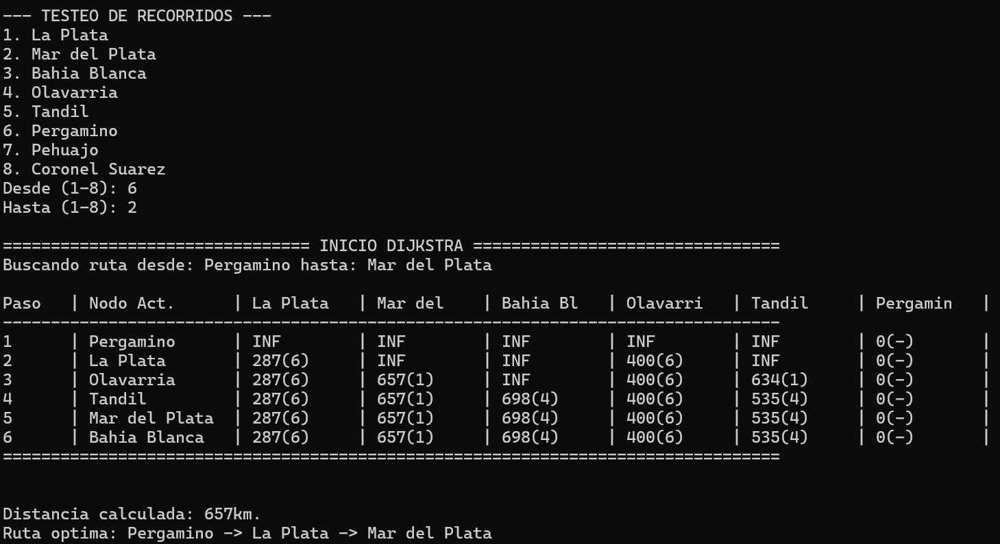

En este documento se explicará detalladamente el funcionamiento del algoritmo de Dijkstra dentro del código, ya sea para el entendimiento del equipo de desarrollo como para el del usuario.

**_Vectores de control_**

```cpp
int n = ciudades.size();

vector<int> distancias(n, INFINITO);
vector<bool> visitados(n, false);
vector<int> predecesores(n, -1);
```

Todos estos vectores tienen el tamaño de la cantidad de ciudades actuales en la matriz, sin importar si están desactivadas o activadas, y se inician con valores estándar.

vector&lt;int&gt; distancias

Este vector guarda las distancias definitivas acumuladas en cada uno de los pasos. Ej:

**La Plata (0) -> Tandil (4) -> Bahia Blanca (2)**

\==

**distancias\[0\] = 0** == La distancia de La Plata a La Plata es 0

**distancias\[4\] = 347** == La distancia acumulada más la distancia a Tandil es 347 (0+347)

**distancias \[2\] = 717** == La distancia acumulada más la distancia a Bahía Blanca es de 717 (347+370)

vector&lt;bool&gt; visitados

Este vector marca a los nodos que ya evaluaron a todos sus vecinos y ya encontró su distancia mínima absoluta desde el origen. El nodo es representado por el índice del vector. Ej:

**visitados\[0\] = true** == El nodo de La Plata ya examino todos sus nodos vecinos y ya tenemos la distancia mínima desde el origen hasta aquí.

vector&lt;int&gt; predecesores

Guarda los IDs predecesores de cada nodo que se visita para luego reconstruir el camino empezando desde el nodo destino. Al igual que el vector "visitados", el nodo es representado por el índice del vector. Ej:

**La Plata (0) -> Tandil (4) -> Bahia Blanca (2)**

\==

**predecesores\[0\] = -1** == La Plata no tiene predecesor porque es el nodo de origen.

**predecesores\[4\] = 0** == A Tandil llegas de forma óptima desde La Plata.

**predecesores\[2\] = 4** == A Bahía Blanca llegas de forma óptima desde Tandil.

Hay que tener en cuenta que estos vectores indexados por ID no contienen únicamente el camino definitivo, tienen datos "basura", ya que Dijkstra analiza el mapa completo. Estos datos toman forma al reconstruir el camino usando el vector "predecesores" y tomando los datos que nos sirven.

**_Funcionamiento del algoritmo de Dijkstra_**

El algoritmo en el código cuenta con tres pasos:

- **Búsqueda del nodo mínimo no visitado**: En este paso, el algoritmo se fija en el vector "distancias" para encontrar el nodo con menor distancia definida. En el primer paso, todos los nodos excepto el de origen están definidos con INFINITO, por lo que el algoritmo elegirá el nodo de origen. Luego de hacer el paso 2, el vector "distancias" se completa con más datos, por lo que al volver al paso 1 el algoritmo es capaz de evaluar entre más nodos.

```cpp
int minId = -1;
int minDistancia = INFINITO;

for(int j = 0 ; j < n ; j++)
{
    if(ciudades[j].activa == false) continue;
    if(!visitados[j] && distancias[j] < minDistancia) 
    {
        minDistancia = distancias[j];
        minId = j;
    }
}
if(minId == -1) break;
visitados[minId] = true;
```

Para hacer esta tarea, el algoritmo comprueba que el nodo esté activo (primer if), que el nodo no esté marcado como visitado, y que la distancia definida acumulada de ese nodo sea menor que la distancia mínima encontrada hasta el momento dentro del for. Una vez encontrado el nodo mínimo, se marca como visitado ya que será el próximo a analizar.

- **Relajación de aristas**: En este paso, el algoritmo evalúa los nodos vecinos del nodo definido en el primer paso. Esta parte del algoritmo comprueba primeramente, al igual que en el primer paso, que el nodo vecino esté activo y que no esté marcado como visitado. Luego, define dos condiciones para cambiar la distancia definida en el vector "distancias" para ese nodo:
  - Que haya camino en la matriz.
  - Que: la distancia acumulada que llevamos + la distancia entre el nodo en el que estamos y el nodo vecino sea < a la distancia que tiene asignado ese nodo en el vector "distancias"

```cpp
for(int v = 0 ; v < n ; v++)
        {
            if(ciudades[v].activa == false) continue;
            if(!visitados[v] && matrizAdyacencia[minId][v] != INFINITO && distancias[minId] + matrizAdyacencia[minId][v] < distancias[v])
            {
                distancias[v] = distancias[minId] + matrizAdyacencia[minId][v];
                predecesores[v] = minId;
            }
        }
```

Dicho de otra forma, esta condición busca verificar si el camino que llevó a ese nodo es mejor que el que el nodo ya tiene definido. En dicho caso, se actualiza el valor en el vector "distancias" con el nuevo valor más óptimo, y se pone como predecesor del nodo al nodo sobre el cual estamos parados.

- **Reconstrucción del camino**: Por último, cuando ya se analizó todo el mapa, se hace la reconstrucción del camino final. Empezando por el nodo destino y terminando en el nodo origen en el vector "predecesores", se reconstruye el camino y se guarda en orden en un vector "camino" que contiene una lista de IDs que forman la ruta óptima desde el origen hasta el destino. A la vez, se le asigna la distancia acumulada total a la variable distanciaTotal para que esta sea usada en el main junto con el vector "camino" para ofrecerle la respuesta completa al usuario.

```cpp
distanciaTotal = distancias[idDestino];
vector<int> camino;

if (distanciaTotal == INFINITO)     // Caso de destino inalcanzable
{
    cout << "\n>>> [ALERTA] No existe ninguna ruta valida para llegar a " << ciudades[idDestino].nombre << "." << endl;
    return {}; // Devolvemos el vector vacío
}

int actual = idDestino;
while (actual != -1)
{
    camino.insert(camino.begin(), actual);
    actual = predecesores[actual];
}
```

**_Integración del algoritmo_**

Con esto, el algoritmo ya queda preparado para ser integrado en el programa. Con el propósito de debuggear y comprobar el funcionamiento sin necesidad de depender de la interfaz, se creó un main para ejecutar el programa por consola 'mainConsole.cpp' y se creó también una función 'imprimirRuta' para poder imprimir de manera legible por consola el vector que devuelve el algoritmo.

Para compilar el ejecutable y probar el funcionamiento, se debe ingresar el siguiente comando en la carpeta \\fuentes:

g++ Grafo.cpp mainConsole.cpp -o ../ejecutables/programaConsola.exe

y luego ejecutar el archivo .exe.

Con el propósito de ayudar a explicar el funcionamiento del algoritmo a la hora de exponerlo, también se imprimen todos los pasos que realiza mediante una tabla en consola.

A continuación un ejemplo del funcionamiento del algoritmo integrado con las funciones de impresión por consola del main:



El algoritmo devuelve la distancia total y la ruta óptima.

La tabla se lee de la siguiente manera:

Cada paso contiene el **nodo actual** sobre el cual uno está parado (paso 1) y el **estado en el que recibe el mapa global** en ese momento (antes de actualizarlo con el paso 2). Esto se debe a que, para la matemática de Dijkstra, la tabla representa el **inicio** de cada iteración, no el final.

Por lo tanto, en el paso 1 se puede ver que el nodo sobre el que estamos parados es Pergamino, y la única información de distancia que tiene es a sí mismo. Entonces, se marca como visitado y se examinan los vecinos;

- La Plata está a 287km: 287 es menor que INF, entonces se actualiza en el vector 'distancias' y se pone como predecesor a Pergamino (6).
- Olavarría está a 400km: 400 es menor que INF, entonces se actualiza en el vector 'distancias' y se pone como predecesor a Pergamino (6).

**NOTA**: Si bien Pergamino cuenta también con conexión hacia Pehuajó, en este caso dicho nodo está deshabilitado junto con Coronel Suarez.

Una vez realizado el paso 2, vuelve al paso 1, esta vez Pergamino está marcado como visitado así que tiene para elegir del vector de distancias a La Plata (287) y Olavarría (400). Elige a La Plata porque es el nodo con menor distancia acumulada, lo marca como visitado, examina a sus vecinos y actualiza el vector de distancias. Repite el paso 1 y 2 hasta visitar todos los nodos, y luego reconstruye el camino con el vector de predecesores. Finaliza el algoritmo y devuelve los resultados.