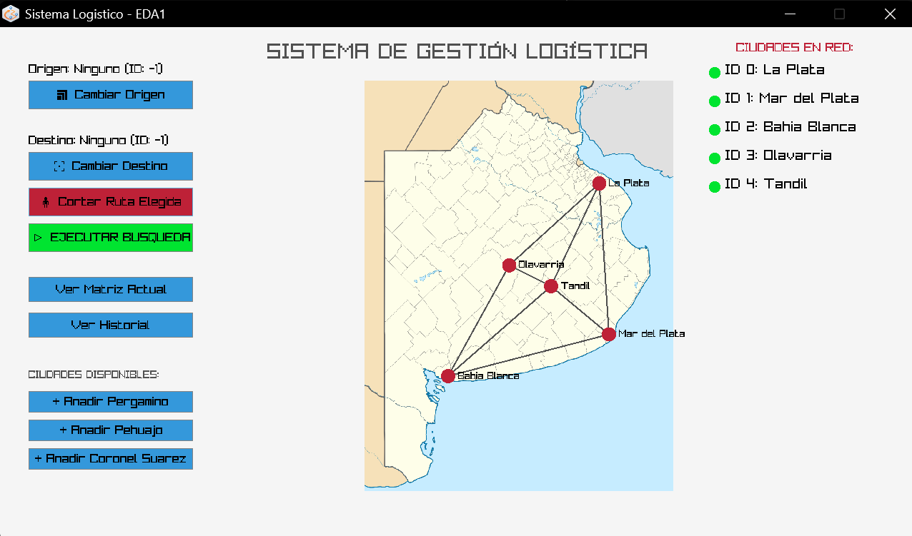
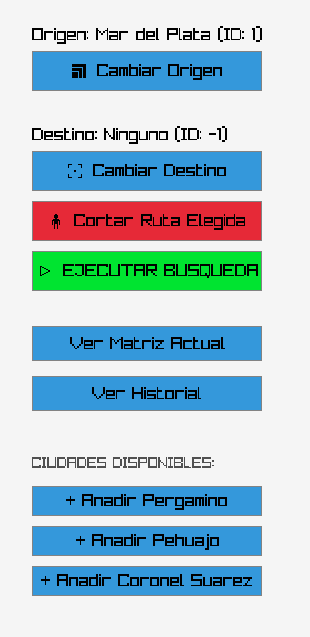
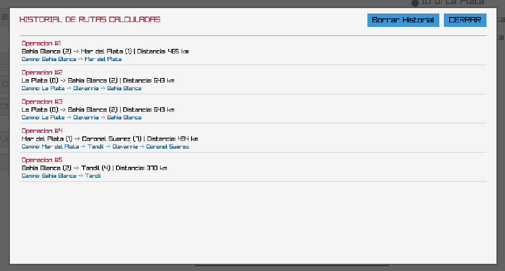
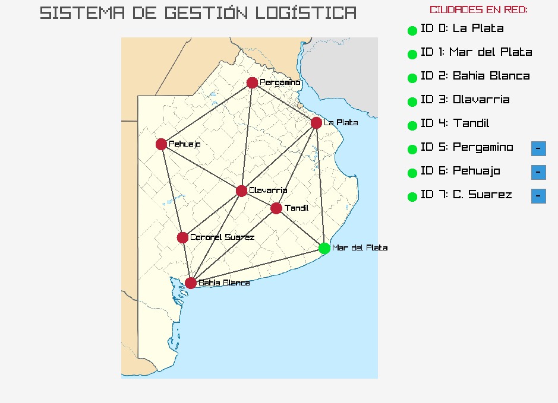
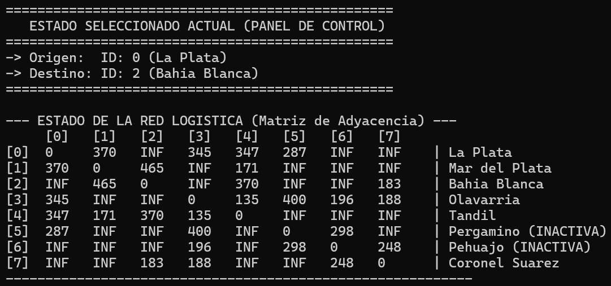
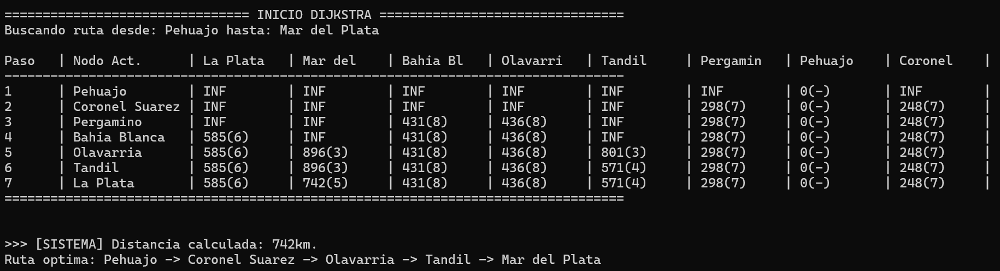

**_Manual de usuario: SIGLOR_**

_Índice_

1. Introducción
2. Requisitos e instalación
3. Guía de interfaz
4. Guía de uso

<strong><em>1. Introducción</em></strong>

SIGLOR (Sistema Inteligente de Gestión Logística y Optimización de Rutas) es una aplicación de escritorio diseñada específicamente para la optimización de redes logísticas de transporte en la provincia de Buenos Aires.

El propósito central del sistema es ofrecer a los coordinadores logísticos una herramienta interactiva y visual para calcular caminos mínimos de distribución. Mediante la implementación del Algoritmo de Dijkstra, el sistema analiza las distancias reales entre centros de distribución y permite simular contingencias en tiempo real, recalculando de manera inmediata trayectos alternativos óptimos.

SIGLOR opera de manera híbrida: combina una ventana gráfica amigable e intuitiva para el procesamiento de comandos e interacción en tiempo real, junto con una terminal de consola detallada encargada de auditar y transparentar los cómputos matemáticos y matrices del grafo logístico.

<strong><em>2. Requisitos e instalación</em></strong>

_Requisitos del sistema_

Para asegurar un correcto desempeño del programa, su computadora debe cumplir con lo siguiente:

- Sistema Operativo: El programa soporta Windows 10/11 (64 bits) y distribuciones Linux modernas basadas en Ubuntu/Debian (64 bits).
- Resolución de pantalla: Mínimo 1280x720 píxeles.

_Instrucciones de instalación_

El archivo se distribuye precompilado en un paquete cerrado para garantizar su portabilidad. Siga estos pasos para iniciar el programa:
Descargue el archivo comprimido del sistema (SIGLOR_v1.0.0-beta.zip).

Extraiga el contenido en una carpeta local de su disco duro.

**AVISO**: No altere, mueva ni renombre las carpetas internas. El programa requiere mantener esta arquitectura de directorios.

Entre a la careta 'programa' y ejecute la aplicación haciendo doble clic sobre el archivo 'programa.exe' (en entornos Windows) o lanzando el binario ejecutable 'programa_linux' desde la terminal (en Linux).

<strong><em>3. Guía de interfaz</em></strong>

Al iniciar SIGLOR, se desplegarán simultáneamente dos ventanas independientes en su monitor. Se recomienda posicionarlas una al lado de la otra para un control absoluto del entorno.

- **_Ventana gráfica principal_**

Esta ventana gráfica representa el centro operativo visual y se divide en dos regiones principales:

**El panel de operaciones**

Concentra la botonera del sistema de un mismo lado para operar más rápida y sencillamente. Cuenta con los botones:

_Selección de origen y destino_

- Cambiar origen: Itera repetidamente sobre los IDs de las ciudades activas (0-4/7) para seleccionar el nodo de origen. El nodo seleccionado se indica encima del botón (Origen: Nodo (ID: -1)), en el panel de control mediante consola y en el mapa.
- Cambiar destino: Itera repetidamente sobre los IDs de las ciudades activas (0-4/7) para seleccionar el nodo de destino. El nodo seleccionado se indica encima del botón (Destino: Nodo (ID: -1)), en el panel de control mediante consola y en el mapa.

_Operación_

- Cortar ruta elegida: Corta la ruta entre los dos nodos elegidos. Por el momento esta función no permite cortar una ruta que no conecte a dos nodos inmediatamente (es decir no puede cortar un camino conformado por varias rutas), y únicamente permite cortar una ruta a la vez. La ruta cortada se eliminará del mapa (esta acción es reversible).
- Ejecutar búsqueda: Realiza la búsqueda del camino más corto entre el nodo de origen y nodo de destino. En consola, imprime el comportamiento del algoritmo de Dijkstra (ver ).

_Estado_

- Ver matriz actual: Imprime el estado actual de la matriz de adyacencia mediante consola.
- Ver historial: Abre una ventana por encima de la interfaz, la cual contiene en orden descendiente el historial de rutas calculadas por el usuario, indicando información como el número de operación, los nodos de origen y destino, la distancia total en kilómetros y el camino obtenido. La ventana se abre desde la operación más reciente, y se navega usando la flecha para arriba (↑) hasta llegar a la operación más antigua. Esta ventana también contiene la opción "Borrar historial", la cual vacía el contenido del historial (ESTA ACCIÓN ES IRREVERSIBLE).

_Alta de nodos_

El programa cuenta con tres nodos opcionales que se pueden dar de alta y de baja según lo que quiera el usuario. Los nodos son:

- \+ Añadir Pergamino
- \+ Añadir Pehuajo
- \+ Añadir Coronel Suarez

**Mapa de nodos**

Cuenta con el mapa de la provincia, los respectivos nodos con los que cuenta el programa actualmente y las rutas que los conectan (ver ), todo representado en su posición geográfica aproximada. Se sigue un patrón de colores, donde:

- Los nodos **no seleccionados** y **activos** son representados en rojo.
- El nodo seleccionado como nodo de **origen** es representado en verde.
- El nodo seleccionado como nodo de **destino** es representado en amarillo.
- Las **rutas** son representadas mediante **líneas negras**.
- El **camino** resultante al ejecutar una búsqueda es marcado en verde.

Además, esta parte de la interfaz también cuenta con una sección "Ciudades en red" que indica las ciudades activas en ese momento en el mapa. Las primeras cinco ciudades (ID 0-4) están siempre activas por requerimiento de la consigna del trabajo, pero las restantes tres ciudades (ID 5-7) pueden ser dadas de alta (mediante el panel de operaciones) y dadas de baja usando esta parte de la interfaz, haciendo click en el botón '-' que se encuentra al lado del nombre de la ciudad.

- **Consola de auditoría de datos**

Es la ventana de comandos tradicional de fondo negro. Mientras usted interactúa haciendo clics en la interfaz gráfica, esta terminal se actualiza automáticamente y vuelca los datos en texto crudo: muestra la matriz de adyacencia de la red, los estados de las operaciones y la tabla de pasos del algoritmo utilizado.

<strong><em>4. Guía de uso</em></strong>

**Flujo operativo 1: Calcular la ruta óptima**

Para encontrar el camino más corto entre dos nodos, realice los siguientes pasos:

- En el panel de operaciones de la interfaz gráfica, presione de forma sucesiva el botón "Cambiar Origen". Notará que el indicador de texto superior irá rotando el ID y el nombre de la ciudad de salida (de 0 a 7). Deténgase en la ciudad deseada.
- Presione sucesivamente el botón "Cambiar Destino" para fijar la ciudad de llegada.
- Haga clic en el botón "EJECUTAR BÚSQUEDA".
- La interfaz gráfica trazará visualmente el camino óptimo sobre el mapa. En la consola de auditoría se indicará el procesamiento del algoritmo (incluido por razones didácticas), y debajo el resultado final, compuesto por la distancia total en kilómetros y el camino conformado por los nodos.

**Flujo operativo 2: Simulación de contingencias**

- Seleccione la ciudad de origen y destino que conformarán la ruta afectada (tienen que ser nodos inmediatos).
- Presione el botón "Cortar ruta elegida".
- Internamente, el sistema elevará el costo de ese tramo al valor de INFINITO (999999), deshabilitándolo por completo.

**Flujo operativo 3**: **Consulta y gestión del historial local**

Cada búsqueda exitosa se almacena en un archivo binario de persistencia local ("historias.dat") de forma privada en su equipo.

- Presione el botón "Ver historial". Se desplegará un cuadro modal (ventana emergente) en el centro de la pantalla.
- La lista empezará por mostrar las últimas operaciones, pudiendo navegar ascendentemente hacia la operación más reciente usando la tecla flecha para arriba '↑'.
- Al estar el historial abierto, todas las funciones de la ventana principal se bloquearán.
- Para borrar el historial, presione el botón "Borrar historial", pero tenga en cuenta que esta acción borra todas las entradas del historial y es irreversible.
- Para salir, presione el botón "CERRAR".