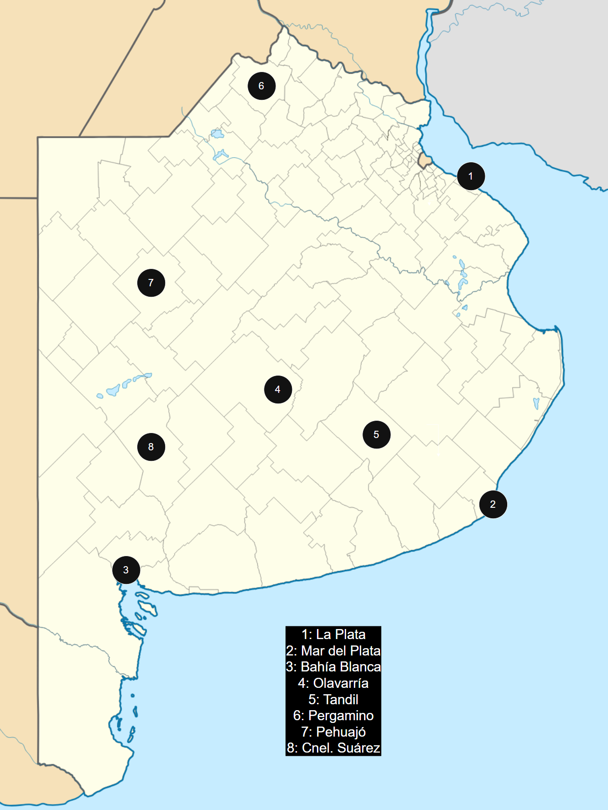
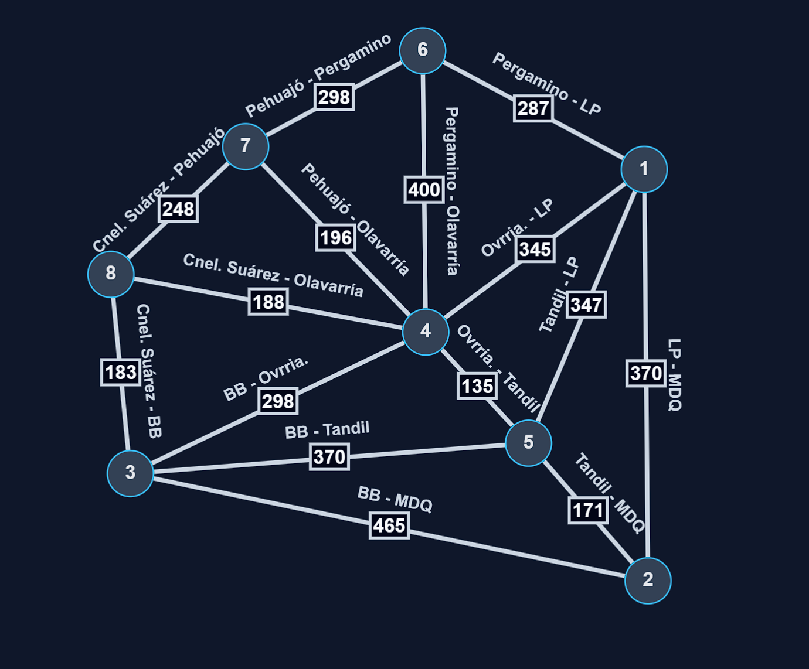

**_Proyecto SIGLOR: Propuesta inicial para la definición de nodos y rutas_**

_Lautaro Bravo 22/04/2026_

El presente documento forma parte de la etapa de investigación y planificación del proyecto final correspondiente a la materia Estructura de Datos y Algoritmos II.

Como primer paso concreto hacia la construcción del sistema, este documento presenta la propuesta de definición de los nodos (ciudades) y las rutas (conexiones) que conformarán el grafo base sobre el cual operará la aplicación. La selección de los nodos se realizó tomando como referencia la provincia de Buenos Aires, priorizando localidades con relevancia logística real, conectividad vial documentada y una distribución geográfica que permita demostrar el funcionamiento del algoritmo de camino más corto ante distintos escenarios.

La red propuesta está compuesta por cinco nodos principales; La Plata, Mar del Plata, Tandil, Olavarría y Bahía Blanca, interconectados mediante ocho rutas basadas en distancias reales expresadas en kilómetros, obtenidas a partir de las rutas nacionales y provinciales que los vinculan.

Las secciones siguientes detallan las características de cada nodo, las conexiones definidas con sus respectivas distancias, y las coordenadas geográficas asociadas a cada ciudad para su representación gráfica dentro de la interfaz de la aplicación.

**_Nodos_**

_Nodos principales_:

La consigna del proyecto nos pide mínimamente 3 nodos. Los siguientes fueron elegidos debido a su importancia logística y su cantidad de conexiones (rutas) posibles con demás nodos.

**La Plata**: Capital de la provincia, centro administrativo y de distribución. Coordenadas:

- Latitud: -34.92
- Longitud: -57.95

**Mar del Plata**: Ciudad más populosa del interior provincial, puerto pesquero activo y gran movimiento comercial.

Coordenadas:

- Latitud: -37.99
- Longitud: -57.55

**Bahía Blanca**: Principal puerto del sur bonaerense, hub de exportación de granos y petroquímica. Nodo clave en logística de larga distancia.

Coordenadas:

- Latitud: -36.71
- Longitud: -62.27

_Nodos secundarios:_

Estos nodos secundarios servirán para proporcionar la conectividad necesaria entre los nodos principales.

**Tandil**: Nodo serrano, industria metalmecánica.

Coordenadas:

- Latitud: -37.33
- Longitud: -59.15

**Olavarría**: Industria cementera, punto medio sur.

Coordenadas:

- Latitud: -36.89
- Longitud: -60.32

_Nodos extra (catálogo)_

Con el propósito de cumplir con la consigna (el usuario debe ser capaz de dar de alta nodos nuevos), se agregó un catálogo de nodos extra de los cuales el usuario podrá seleccionar el que desee para dar de alta. Esto debido a que para añadir dinámicamente nodos y sus rutas al programa, se requeriría el uso de alguna API, lo cual excede el contenido de la materia y del proyecto.

Dicho esto, los nodos agregados son los siguientes:

**Pergamino**: Polo agroindustrial, gran movimiento de granos.

- Latitud: -33.89
- Longitud: -60.57

**Pehuajó**: Nodo agroindustrial del centro-oeste, importante movimiento de granos y ganado.

- Latitud: -35.85
- Longitud: -61.90

**Coronel Suárez**: Nodo agroindustrial del sudoeste bonaerense.

- Latitud: -37.46
- Longitud: -61.93

**_Conexiones_**

**La Plata - Mar del Plata**

La Plata conexión a Mar del Plata mediante RN2, 370km.

**La Plata - Tandil**

La Plata conexión a Tandil mediante RP215, RP29 y RP74, 347km.

**La Plata - Olavarría**

La Plata conexión a Olavarria mediante RP215, RN3 y RN226, 345km.

**Tandil - Mar del Plata**

Tandil conexión a Mar del Plata mediante RN226, 171km.

**Tandil - Olavarría**

Tandil conexión a Olavarría mediante RN226, 135km.

**Tandil - Bahía Blanca**

Tandil conexión a Bahía Blanca mediante RP74 y RN3, 370km.

**Mar del Plata - Bahía Blanca**

Mar del Plata conexión a Bahía Blanca mediante RP88, RN228 y RN3, 465km.

**Olavarría - Bahía Blanca**

Olavarría conexión a Bahía Blanca mediante RP51, 298km.

**Olavarría - Mar del Plata**

Olavarría conexión a Mar del Plata mediante RN226, 305km.

**Pergamino - La Plata**

Pergamino conexión La Plata mediante RN8, 287km.

**Pergamino - Pehuajó**

Pergamino conexión La Plata mediante RN188 y RP50, 298km.

**Pergamino - Olavarría**

Pergamino conexión Olavarría mediante RP65 y RN226, 400km.

**Pehuajó - Cnel. Suárez**

Pehuajó conexión Cnel. Suárez mediante RP86, 248km.

**Pehuajó - Olavarría**

Pehuajó conexión Olavarría mediante RN226, 196km.

**Cnel. Suárez - Olavarría**

Cnel. Suárez conexión Olavarría mediante RP51, 188km.

**Cnel. Suárez - Bahía Blanca**

Cnel. Suárez conexión Bahía Blanca mediante RN33, 182km.

Si bien se especifican las rutas que toma cada camino, esto es más que nada para entender y visualizar mejor los caminos existentes. A la hora de realizar los cálculos para decidir el camino más corto, se tomará todo el conjunto de rutas que constituye el camino como una sola línea.

A continuación se resumirá la información necesaria de este documento en tablas para hacer su posterior utilización más rápida.

**_Coordenadas_**

| **Ciudades**    | **Latitud** | **Longitud** |
| --------------- | ----------- | ------------ |
| _La Plata_      | \-34.92     | \-57.95      |
| _Mar del Plata_ | \-37.99     | \-57.55      |
| _Bahía Blanca_  | \-36.71     | \-62.27      |
| _Olavarría_     | \-37.33     | \-59.15      |
| _Tandil_        | \-36.89     | \-60.32      |
| _Pergamino_     | \-33.89     | \-60.57      |
| _Pehuajó_       | \-35.85     | \-61.90      |
| _Cnel. Suárez_  | \-37.46     | \-61.93      |

**_Matriz de adyacencia_**

|       | **1** | **2** | **3** | **4** | **5** | **6** | **7** | **8** |
| ----- | ----- | ----- | ----- | ----- | ----- | ----- | ----- | ----- |
| **1** | 0     | 370   | ∞     | 345   | 347   | 287   | ∞     | ∞     |
| **2** | 370   | 0     | 465   | ∞     | 171   | ∞     | ∞     | ∞     |
| **3** | ∞     | 465   | 0     | 298   | 370   | ∞     | ∞     | 183   |
| **4** | 345   | ∞     | 298   | 0     | 135   | 400   | 196   | 188   |
| **5** | 347   | 171   | 370   | 135   | 0     | ∞     | ∞     | ∞     |
| **6** | 287   | ∞     | ∞     | 400   | ∞     | 0     | 298   | ∞     |
| **7** | ∞     | ∞     | ∞     | 196   | ∞     | 298   | 0     | 248   |
| **8** | ∞     | ∞     | 183   | 188   | ∞     | ∞     | 248   | 0     |
