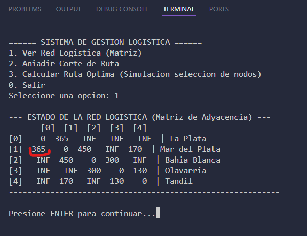
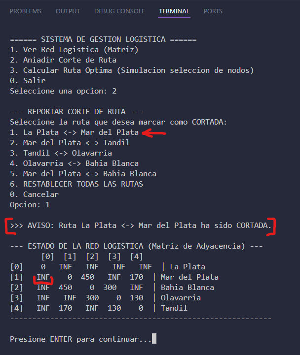

# Capturas avances - SIGLOR

## 1. Red Logística Inicial (desde consola)
matriz de adyacencia con los pesos de las rutas.

## 2. Gestión de Contingencias (desde consola)
Al seleccionar un corte de ruta, el sistema reemplaza el peso por INF.
